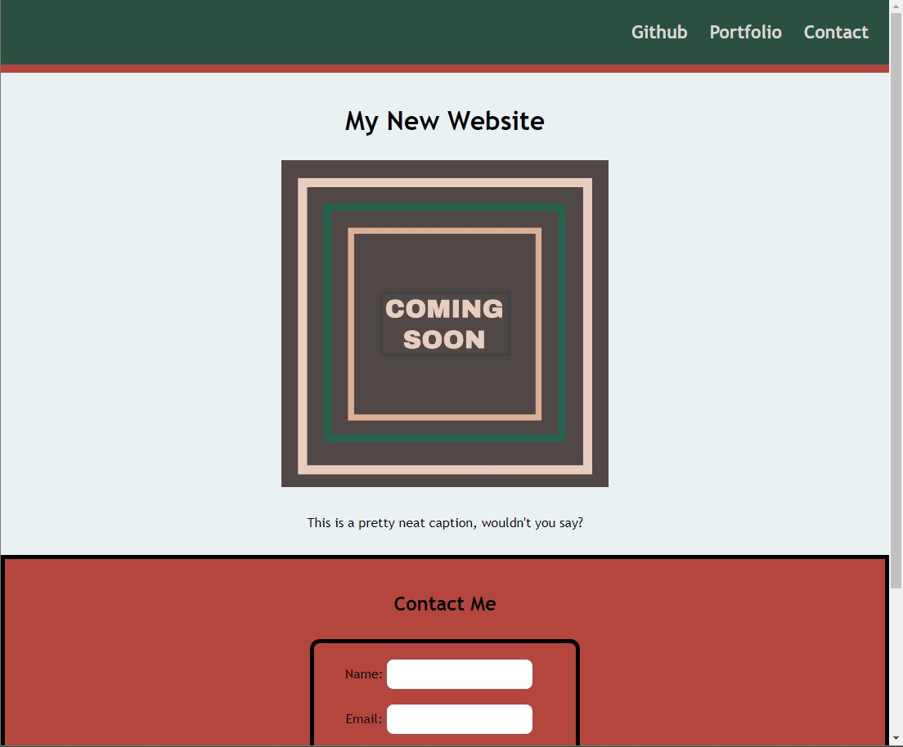
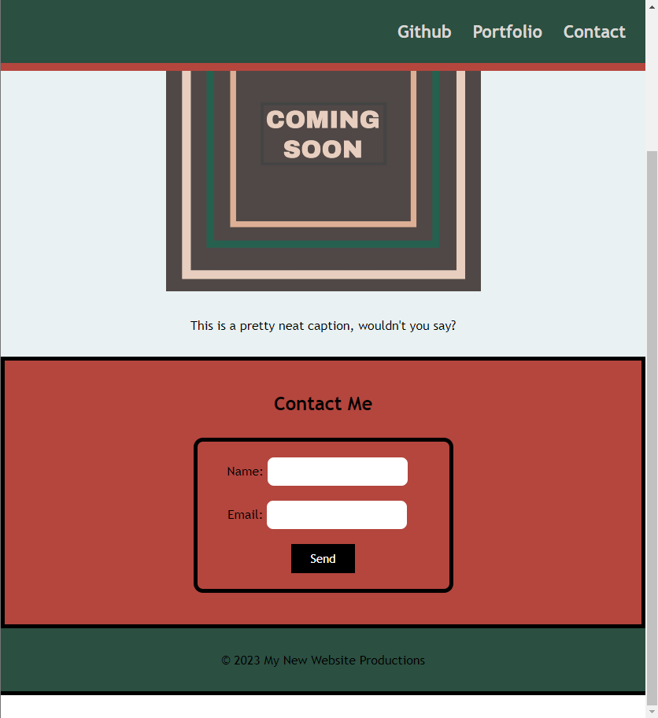

# Landing Page 

## Description

A landing page that has links to github and collects visitor's contact information.

A landing page containing a header, footer, a main section with an image and a caption, and a Contact Me form to collect visitor contact information.

## Installation

visit: 
https://dossman-thomas.github.io/Landing-page-site/

## Usage

Use the navigation bar to visit my Github page or to jump to the contact form.

Input your name and email address in the contact form and press the submit button.

## Badges

